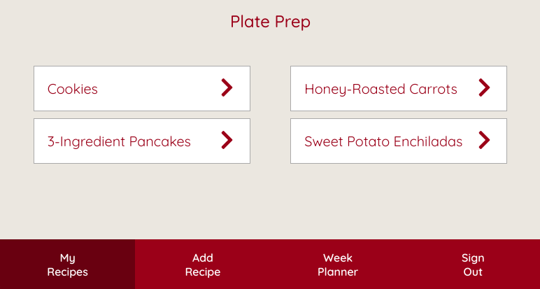
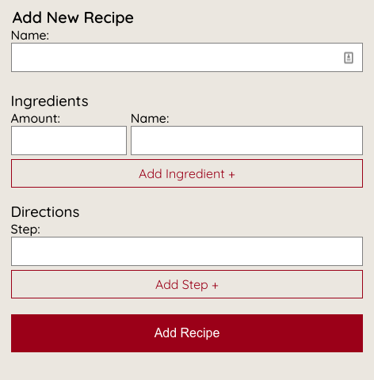
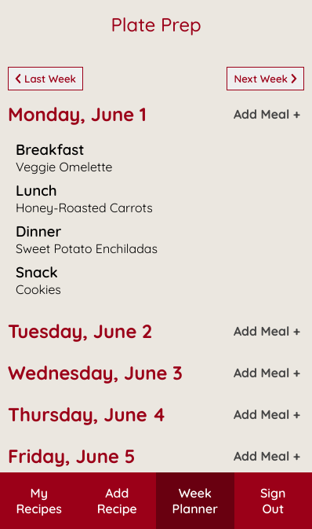
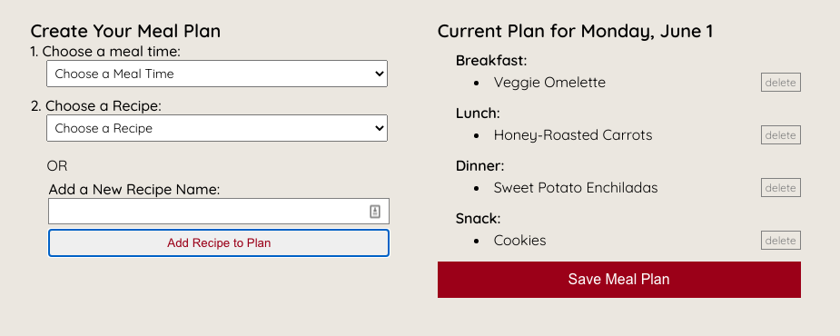
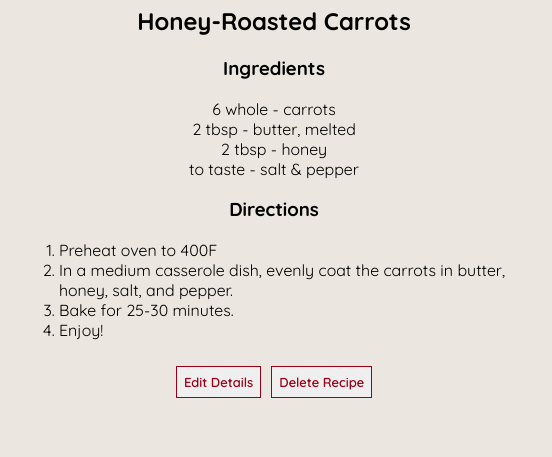

# Plate Prep

## Demo
[Live App](https://plate-prep-app.sloach1218.now.sh/)

Demo Account Login:
* username: Demo_User
* password: Password1!

## About
Plate Prep lets you keep your recipes and weekly meal plan all together in one easy to use app! 

First, add recipes:

Then, create your weekly meal plan with your recipes:

Come back any time to review/update recipe details and your week meal plan:

## Tech
* HTML5
* CSS
* JS
* React
* Express
* Node.js
* PostgresSQL

## Documentation
* **A user creates an account.**  This sends a POST request to /users. The server adds the username and bcrypted password to the database after checking that the username doesn't already exist.
* **A returning user visits the landing page and logs in.**  This sends a POST request to /auth/login. The server checks in the database for the user/password and sends an authToken if username/password exists.
* **A user successfully logs in and is taken to the home page.**  This sends a GET request to /recipes and /planner. The server checks in the database and sends recipes and planner dates with the same user id as the logged in user.
* **A user submits add recipe form.**  This sends a POST request to /recipes. The server adds the recipe to the database.
* **A user submits edit recipe form.**  This sends a PATCH request to /recipes. The server updates the recipe in the database.
* **A user clicks delete recipe button.**  This sends a DELETE request to /recipes. The server deletes the recipe and any associations within the planner table in the database.
* **A user clicks save meal plan in the add meal form.**  This sends a POST request to /planner. The server adds the date with meals to the database.

## API
[Repo](https://github.com/sloach1218/plate-prep-api)